#  Gymate

> **TRAIN. EAT. GROW.**

Gymate is a gamified fitness and health application built around three core pillars:

**Training • Nutrition • Activity**

It combines workout tracking, diet and nutrition management, activity tracking, XP progression, Pokémon-inspired collection and evolution, a Pokédex, PC storage, and achievement-based gym badges into a single pixel-art mobile experience.

The goal of Gymate is to make consistent fitness more engaging by adding a progression system on top of the core fitness experience.

---

##  Download

### Demo APK

The recommended version for trying Gymate.

The Demo build contains a prepared sample profile with existing workout, activity, Pokémon, progression, and achievement data so the implemented systems can be explored immediately.

**[⬇️ Download Gymate Demo APK](https://github.com/Shravan-1011/Gymate/releases/tag/v1)**

### Developer APK

A development build containing additional developer/testing functionality.

**[ Download Gymate Dev APK](https://github.com/Shravan-1011/Gymate/releases/tag/v1-dev)**

> Both APKs are distributed through the GitHub Release.

### 🧪 Sample Test Profile

A prepared sample profile is available for exploring features that would otherwise require significant time to populate manually.

The sample profile can be used to check things such as:

-  Workout history and training progress
-  Trainer XP and progression
-  Pokémon collection
-  Pokédex progress
-  Pokémon evolution
-  Gym Badges and achievements
-  Step activity
-  Running history and run details
-  Nutrition and diet tracking

**[📥 Download Sample Profile](docs/Gymate_test_2026-10-04.gymate)**

> **How to use:** Install the Demo APK first, then when in the create profile section click on restore backup and then select the downloaded sample profile then enter the new password whatever you want and click restore backup and voila you are on the sample backup.

---

#  Features

##  Training

Gymate provides a complete workout tracking system for recording and reviewing training sessions.

### Workout Tracking

- Start workouts from configured workout splits
- Add exercises to a workout
- Remove exercises
- Add sets
- Update weight and repetitions
- Mark sets as completed
- Track workout duration
- Persist active workouts
- Finish and save completed workouts

### Workout History

- View completed workout sessions
- Open individual workout summaries
- Review workout duration
- Review total training volume
- Review completed sets
- Compare sessions
- Compare exercise-level performance

### Training Progress

- Training statistics
- Training volume tracking
- Volume trends
- Workout frequency
- Current workout streak
- Best workout streak
- Average workout volume

---

##  Diet & Nutrition

Gymate includes a daily nutrition tracking system designed around calories, protein, and water intake.

### Daily Nutrition

- Track daily calories
- Track daily protein
- Track daily water intake
- View remaining daily targets
- View progress toward nutrition goals

### Food Tracking

- Add food
- Edit food
- Delete food
- Specify food quantity
- Calculate nutrition based on quantity
- Store daily food records

### Food Database

Gymate includes a built-in food nutrition database used to calculate nutritional values for supported foods.

Nutrition calculations can be based on the quantity of food entered by the user.

### Food Templates

- Create reusable food templates
- Apply templates to a day
- Edit templates
- Delete templates
- Preserve historical daily food values

Daily records use snapshots so that changing a reusable template does not unexpectedly change previously recorded nutrition history.

### Water Tracking

- Track daily water intake
- Add water
- Remove water
- View daily water progress

---

#  Activity

Gymate includes activity tracking for everyday movement and running.

##  Steps

- Track daily steps
- Track progress toward the daily step goal
- View step history
- View historical step graphs
- Track step-based XP progression

##  Running

Gymate includes GPS-based running activity.

Features include:

- Start a run
- Track GPS position
- Record running route
- Display route on a map
- Track distance
- Track duration
- Track pace
- Track best pace
- Track GPS accuracy
- Save completed runs
- View run history
- Open detailed run records

### Run Details

Saved runs provide information including:

- Route
- Distance
- Duration
- Average pace
- Best pace
- GPS information
- Recorded route points

---

#  XP & Progression

Gymate uses XP as a progression layer across the application.

XP can be earned through supported fitness and activity actions.

The progression system connects different parts of the application instead of creating separate progression systems for individual features.

### Progression includes:

- Trainer XP
- Trainer levels
- Activity-based XP
- Fitness progression
- Pokémon progression
- Achievement progression
- Badge progression

---

#  Pokémon System

Pokémon is the gamification layer of Gymate.

The system is designed to make fitness progression more engaging while keeping training, nutrition, and activity as the core of the application.

##  Starter Pokémon

Users begin their Pokémon journey with a starter Pokémon.

The starter can then gain experience and progress through the Pokémon system.

##  Pokémon Collection

Gymate supports collecting Pokémon through its Pokéball system.

Pokémon have properties such as:

- Species
- Pokédex number
- Name
- Rarity
- Type
- Level
- XP
- Source
- Evolution stage

##  Pokédex

Gymate maintains a permanent Pokédex registration system.

Once a species has been registered, its Pokédex entry remains registered even if the Pokémon's current form changes through evolution.

##  Pokémon PC

The PC provides storage for collected Pokémon that are not currently part of the active team.

The PC includes:

- Pokémon grid
- Rarity categories
- Search
- Filtering
- Sorting
- Pokémon levels
- Pokémon details

##  Pokémon XP & Levels

Pokémon can gain XP and increase their level.

Their progression is independent from the Trainer's XP progression.

##  Pokémon Evolution

Pokémon can evolve when their progression reaches the appropriate evolution requirements.

The evolution system includes:

- Evolution checks
- Species transitions
- Evolution events
- Evolution animations
- Evolution audio
- New Pokémon reveal
- Pokémon cries

Evolution also registers the newly reached species in the Pokédex.

---

#  Pokéball System

Gymate includes different Pokéball types with different Pokémon acquisition rules.

##  Jester Ball

The Jester Ball is one of the Pokémon acquisition systems currently implemented.

It costs:

**4 shards**

Its rarity distribution is:

| Rarity | Chance |
|---|---:|
| Common | 80% |
| Uncommon | 12% |
| Rare | 5% |
| Legendary | 3% |

The weighting is applied to the Pokémon that are still available to the user.

Previously registered Pokémon are excluded from future Jester Ball rolls.

---

#  Gym Badges & Achievements

Gymate contains an achievement-based Gym Badge system.

There are:

**8 badge families**

Each family contains:

- Normal badge
- Gold badge

This gives the system a total of:

**16 badge variants**

## Badge Collection

The Gym Badges section provides separate views for:

- Normal badges
- Gold badges

Badges can be:

- Locked
- Earned
- Gold

## Achievements

Achievements provide goals that can unlock Gym Badges and contribute to the overall progression system.

---

#  Trainer Profile

The profile acts as the user's trainer card.

It contains information such as:

- Trainer name
- Height
- Weight
- Fitness goal
- Current streak
- Trainer XP
- Trainer level
- Pokédex progress
- Gym badge progress
- Displayed badges
- Trainer character

The profile also provides access to profile-related configuration.

---

#  Design

Gymate follows a **dark-mode-first 8-bit / pixel-art visual direction**.

The visual identity is built around:

- Pixel-art graphics
- Pixel-style typography
- Dark backgrounds
- High-contrast UI
- Lime-green accent color
- Game-inspired cards
- Compact information layouts
- Retro game aesthetics

The goal is to make Gymate feel like a **fitness application with a game layer**, rather than a game with fitness features added to it.

---

# Screenshots

## Home

The Home screen provides a quick overview of the user's daily progress and current Pokémon partner.

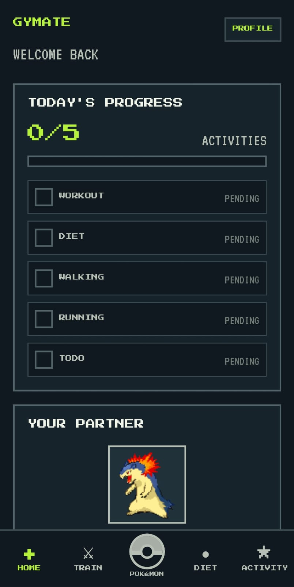

---

## Training

The Training section provides access to workouts, workout history, and training progress.

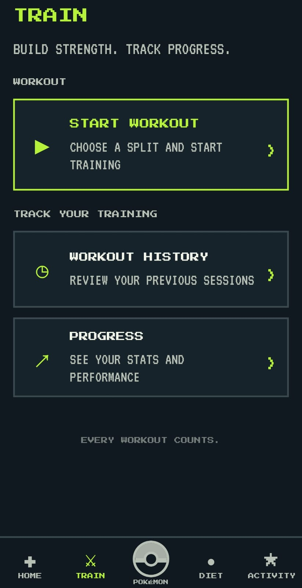

---

## Training Progress

Review training statistics, workout volume, and progress over time.

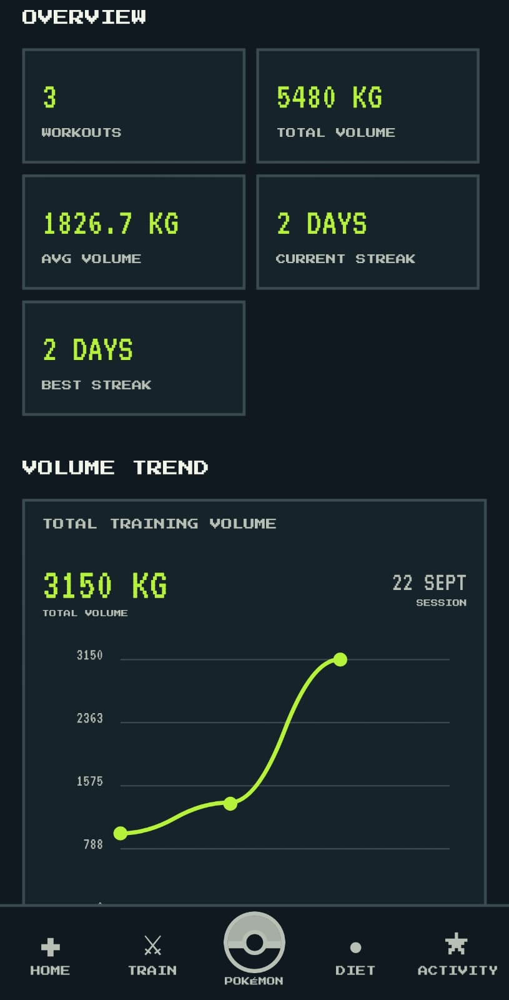

---

## Diet

Track daily calories, protein, water intake, food, and nutrition goals.

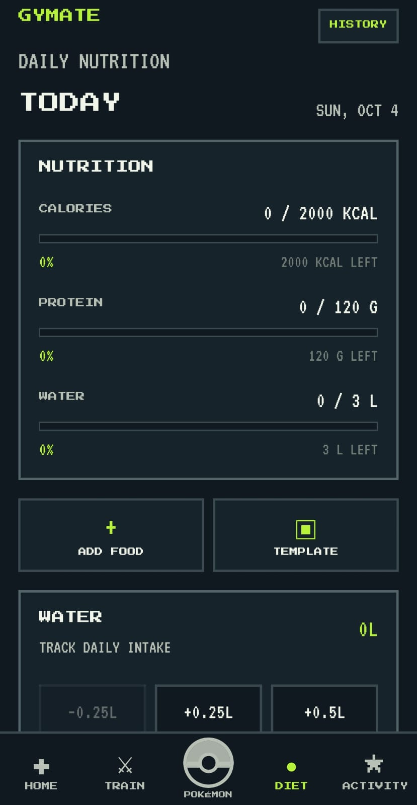

---

## Step Counter

Track daily steps and earn progression through activity.

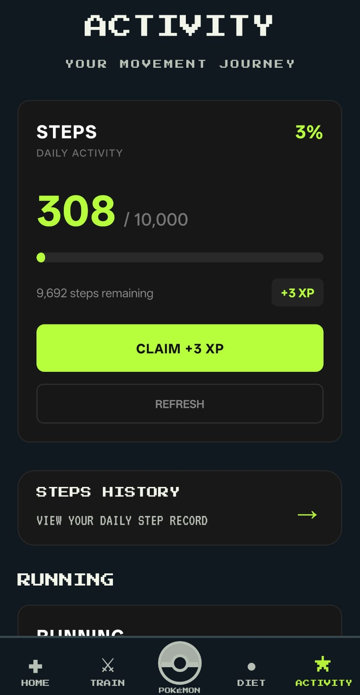

---

## Running

Track running activity using GPS and review completed runs.

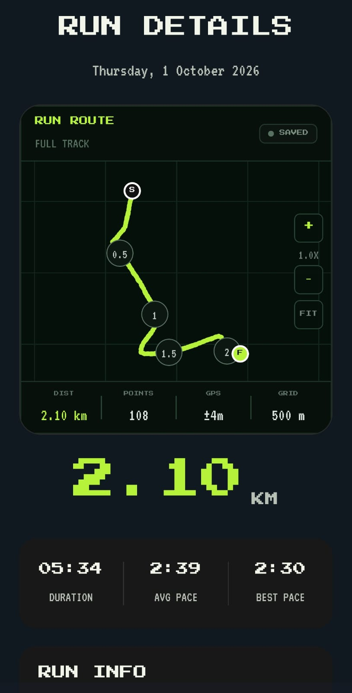

---

## Pokémon

The Pokémon section provides access to the user's Pokémon journey and collection.

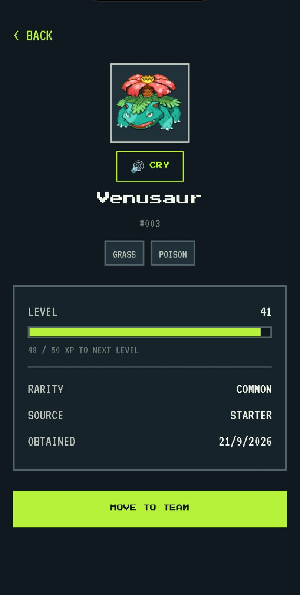

---

## Pokémon Collection

Browse collected Pokémon and manage the collection.

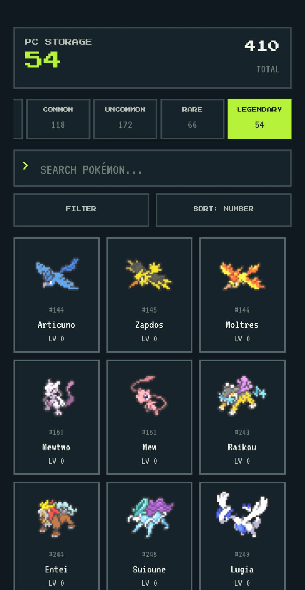

---

## Pokémon Evolution

Pokémon evolution has its own dedicated visual sequence with animation and audio.

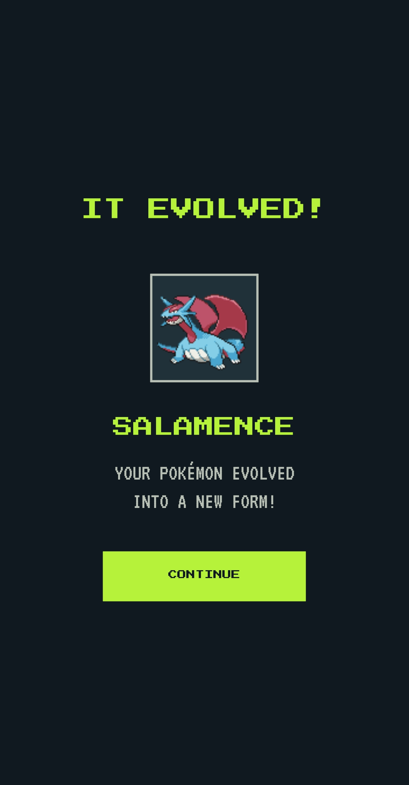

---

## Achievements & Gym Badges

Complete achievements and collect Gym Badges.

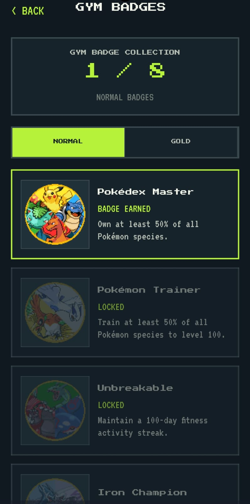

---

## Trainer Profile

The Trainer Profile combines personal fitness information, Trainer XP, Pokédex progress, and Gym Badges.

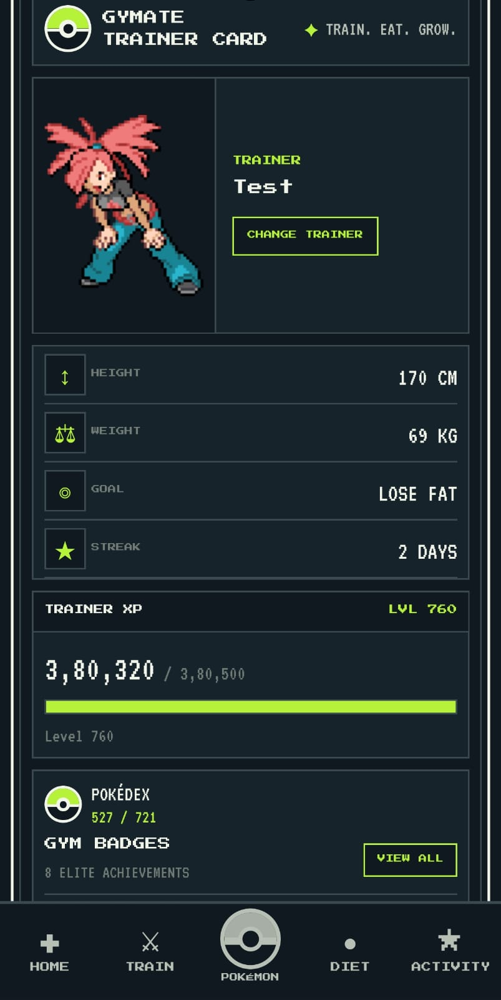

#  Tech Stack

| Technology | Usage |
|---|---|
| **React Native** | Mobile application |
| **Expo** | React Native development and build platform |
| **Expo Router** | File-based navigation |
| **TypeScript** | Type-safe application development |
| **SQLite** | Local structured data storage |
| **AsyncStorage** | Local application persistence |
| **React Native Health Connect** | Health and step data |
| **Expo Location** | GPS and running activity |
| **Expo Audio** | Music, sound effects and Pokémon audio |
| **Expo Sensors** | Device sensor access |
| **EAS Build** | Android application builds |

---

#  Project Structure

```text
Gymate/
│
├── app/                    # Application screens and routes
├── assets/                 # Images, Pokémon assets, audio, fonts
├── components/             # Reusable UI components
├── constants/              # Theme and application constants
├── context/                # React context providers
├── data/                   # Static application data
├── database/               # Local database layer
├── services/               # Application business logic
├── types/                  # TypeScript definitions
├── utils/                  # Utility functions
│
├── docs/
│   └── screenshots/        # README screenshots
│
├── app.json
├── eas.json
├── package.json
├── tsconfig.json
└── README.md